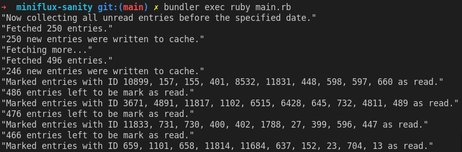

# miniflux-sanity

A Ruby command-line utility to mark older entries as read on your Miniflux app. Defaults to items older than 30 days.

As is usually the case for me, I wanted to build something meaningful as I pick up Ruby again. This was a small use-case that was a good first challenge to tackle.

The code is admittedly not perfect. I welcome any constructive criticism or feedback, more so if you are a Ruby enthusiast.

## Feature-set

- Uses token authentication
- Supports cloud and self-hosted Miniflux apps
- Configure number of days before which to mark items as read
- Resumes marking as read if interrupted

## To-do

- [ ] Resume fetching if command crashes in between
- [ ] If an item is starred _and_ unread, don't mark it as read.
    - This could lend itself to a nice workflow where my "to-read" can be starred while scanning through items.

## Goals

- Get comfortable with Ruby's syntax
- Work with `Class`, `Module`, `dotenv` etc.
- Work with `JSON`
- Work with Ruby's `File` API
- Interact with an API using an HTTP library

## Usage

The Ruby version is specified in `.ruby-version`. `rbenv` is able to read and set the correct local version in your shell.

- `git clone git@github.com:hirusi/miniflux-sanity.git`
- `cd miniflux-sanity`
- `cp .env.template .env`
- Update the `.env` file as required.
    - You'll need a token from your Miniflux app under `Settings > API Keys -> Create a new API key`
- Install the dependencies: `bundle`
- Run the utility: `bundle exec ruby main.rb`
    - The first run could likely take a while; please be patient!
- Optionally, set up a CRON job to run daily :)

If you have a Docker setup to contribute using Alpine OS as its base, I'd be very happy to merge your PR.